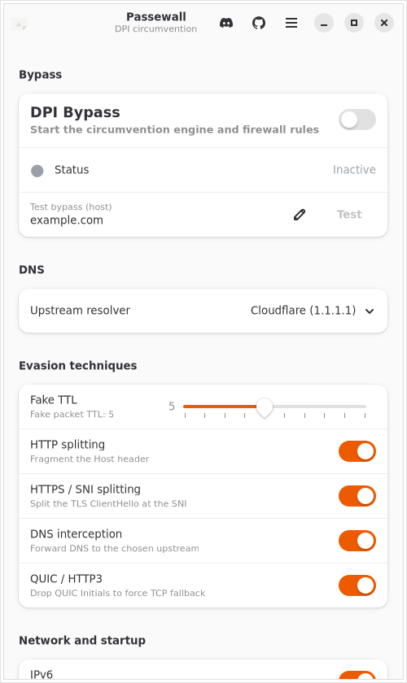

<div align="center">

# Passewall

**A Linux tool for bypassing deep packet inspection — a GoodbyeDPI equivalent.**

[](LICENSE)
[](#)
[](#build-from-source)
[](#)
[](https://discord.gg/ABNRndZhcF)

[GitHub](https://github.com/TaigaLinux/passewall) · [Discord](https://discord.gg/ABNRndZhcF)

</div>

---

## What it is

**Passewall** intercepts your own outgoing traffic with the Linux netfilter
subsystem and rewrites it just enough that censorship middleboxes — the "deep
packet inspection" (DPI) boxes some ISPs and networks use to detect and block
connections — fail to classify it, while the destination server still receives a
completely valid request.

It is the spiritual counterpart of [GoodbyeDPI](https://github.com/ValdikSS/GoodbyeDPI)
(which is Windows-only) for Linux, built natively on `libnetfilter_queue`, with a
clean GTK4 / libadwaita interface and a system tray.

### Why it exists

GoodbyeDPI showed that a handful of low-level packet tricks are enough to defeat
a lot of real-world DPI censorship without any remote proxy or VPN. On Windows it
uses WinDivert; on Linux the equivalent building block is NFQUEUE. Passewall packages
those techniques into a single, native, installable Linux application with both a
GUI and a headless mode.

### How it works

When enabled, Passewall applies the combined technique set (equivalent to GoodbyeDPI's
`-5` mode):

| Technique | What it does |
|-----------|--------------|
| **TCP fragmentation** | Splits the first application data segment into two TCP segments so the DPI can't match on a single packet. |
| **Fake packet injection** | Sends a duplicate of the first segment with a low TTL (default 5) so it dies *after* the DPI box but *before* the server, poisoning stateful reassembly. |
| **HTTP Host splitting** | Fragments the `Host:` header across the two segments. |
| **TLS / SNI splitting** | Splits the ClientHello at the SNI field boundary. |
| **DNS interception** | Captures outbound UDP/53 queries and forwards them to a resolver you choose (Cloudflare/Google/custom), with a fallback. |
| **QUIC / HTTP3 awareness** | Optionally drops QUIC Initial packets on UDP/443 so browsers fall back to TLS-over-TCP, which the TCP path defeats. |

Injected packets carry a firewall mark and are skipped by the queue, so Passewall
never re-processes its own traffic.

> **Note**
> Passewall is a censorship-circumvention and network-research tool. It is **not** a
> VPN and does **not** encrypt or anonymize your traffic. Use it in accordance
> with your local laws.

---

## Supported distributions

Passewall is pure C with no architecture-specific code and targets **amd64** and
**arm64**. It is regularly built on:

- **Debian / Ubuntu** and derivatives (apt)
- **Arch Linux / Manjaro** (pacman)
- **Fedora** (dnf)
- **openSUSE** (zypper)

Any distribution with a Linux kernel that has `nfnetlink_queue`, plus
`iptables`, `libnetfilter_queue`, GTK4 and libadwaita, will work.

---

## Install

### Flatpak

> 🚧 **Flathub submission coming soon.** Passewall is not on Flathub yet, so there
> is no `flatpak install` command to run right now. In the meantime, install
> [from source](#one-line-source-install) (below).
>
> A [Flatpak manifest](flatpak/io.github.taigalinux.Passewall.yml) is included for local
> builds. Note that the Flatpak sandbox cannot be granted the `CAP_NET_ADMIN` /
> `CAP_NET_RAW` capabilities Passewall needs to filter traffic, so the Flatpak is
> primarily for the GUI and development — for full functionality, install from
> source and run with privileges.

### One-line source install

The bundled installer detects your package manager, installs every dependency,
builds, and installs system-wide:

```bash
git clone https://github.com/TaigaLinux/passewall.git
cd passewall
./install.sh
```

Then launch it:

```bash
sudo passewall
```

---

## Build from source

### Dependencies

**Debian / Ubuntu (apt):**

```bash
sudo apt update
sudo apt install build-essential meson ninja-build pkg-config \
    libnetfilter-queue-dev iptables libgtk-4-dev libadwaita-1-dev
```

**Arch Linux (pacman):**

```bash
sudo pacman -Sy --needed base-devel meson ninja pkgconf \
    libnetfilter_queue iptables gtk4 libadwaita
```

**Fedora (dnf):**

```bash
sudo dnf install gcc meson ninja-build pkgconf-pkg-config \
    libnetfilter_queue-devel iptables gtk4-devel libadwaita-devel
```

### Build & install

Using Meson directly:

```bash
meson setup build --prefix=/usr/local
ninja -C build
sudo ninja -C build install
```

Or via the Makefile wrapper:

```bash
make            # configure + build
sudo make install
```

To build a **headless** binary without the GUI dependencies:

```bash
meson setup build -Dgui=false
ninja -C build
# or: make GUI=false
```

---

## Usage

Passewall must run as **root** (or with `CAP_NET_ADMIN` + `CAP_NET_RAW`) because it
programs `iptables` and injects raw packets.

```bash
sudo passewall                 # launch the full GUI
sudo passewall --no-gui        # headless: apply the bypass, no window
sudo passewall --tray          # start in the system tray only
```

### CLI flags

| Flag | Description | Default |
|------|-------------|---------|
| `--dns-addr <ip>` | Upstream DNS resolver | `1.1.1.1` |
| `--ttl <n>` | Fake packet TTL (1–10) | `5` |
| `--no-ipv6` | Skip `ip6tables` rules | (IPv6 on) |
| `--no-gui` | Run headless, no window | — |
| `--tray` | Start with only a tray icon | — |
| `--verbose` | Log every intercepted packet | off |
| `-h`, `--help` | Show help | — |
| `-V`, `--version` | Show version | — |

Example — headless, custom resolver, aggressive TTL, IPv4 only:

```bash
sudo passewall --no-gui --dns-addr 9.9.9.9 --ttl 3 --no-ipv6 --verbose
```

Stop a headless instance with `Ctrl-C`; it removes exactly the firewall rules it
added.

### GUI at a glance

- **DPI Bypass** master switch — starts/stops the engine and firewall rules.
- **Status** dot — green "Active" / grey "Inactive".
- **DNS** — Cloudflare, Google, or a custom server.
- **Fake TTL** slider (1–10).
- Per-technique toggles: HTTP, HTTPS/SNI, DNS interception, QUIC/HTTP3.
- **Verbose logging** with an expandable, terminal-style live log.
- **IPv6**, **Run on login**, and **Start minimized to tray**.
- A tray icon whose colour tracks the active state, with an
  Enable/Disable · Open Window · Quit menu.

---

## Screenshots

<table>
<tr>
<td width="300"></td>
<td valign="top">

The main window keeps the important controls up front:

- **DPI Bypass** master toggle with a live status dot and a one-click **Test** button.
- **DNS** resolver selector — Cloudflare, Google, or a custom server.
- **Fake TTL** slider (1–10).
- Per-technique switches — HTTP splitting, HTTPS/SNI splitting, DNS interception, QUIC/HTTP3.
- IPv6, autostart, close-to-tray, and a terminal-style live activity log further down.

Built with GTK4 + libadwaita, so it follows your system light/dark theme.

</td>
</tr>
</table>

---

## Autostart

The "Run on login" toggle writes or removes:

```
~/.config/autostart/io.github.taigalinux.Passewall.desktop
```

When "Start minimized to tray" is also enabled, the autostart entry's `Exec`
line passes `--tray` so Passewall launches quietly into the tray at login.

---

## Community

- 💬 **Discord** — questions, help, and technique discussion:
  [discord.gg/ABNRndZhcF](https://discord.gg/ABNRndZhcF)
- 🐙 **GitHub** — source, issues, and releases:
  [github.com/TaigaLinux/passewall](https://github.com/TaigaLinux/passewall)

---

## Contributing

Contributions are welcome!

1. **Fork** the repository and create a feature branch.
2. Keep the code style consistent: C11, 4-space indentation, no tabs, an
   `// SPDX-License-Identifier: Apache-2.0` header on every `.c`/`.h` file.
3. Every system call should be error-checked; the engine must always be able to
   cleanly remove its firewall rules on exit.
4. Build with warnings enabled (`meson setup build`, warning level 2) and make
   sure it is clean.
5. Test both the GUI and `--no-gui` paths, and IPv4 and IPv6 where relevant.
6. Open a **pull request** describing the change and the DPI/censorship scenario
   it addresses.

Bug reports and technique ideas are equally valuable — please
[open an issue](https://github.com/TaigaLinux/passewall/issues) with enough detail to
reproduce (distro, kernel, the site or protocol, and a `--verbose` log), or drop
into the [Discord](https://discord.gg/ABNRndZhcF) to chat.

---

## License

Passewall is licensed under the **Apache License 2.0** — see [LICENSE](LICENSE).

Third-party dependencies retain their own licenses (libnetfilter_queue is GPLv2;
GTK4, libadwaita and libayatana-appindicator are LGPLv2.1). See [NOTICE](NOTICE)
for details and an important note on GPLv2 compliance when redistributing
pre-built binaries.

<div align="center">
<sub>Made for a freer internet. Passewall does not encrypt traffic and is not a VPN.</sub>
</div>
